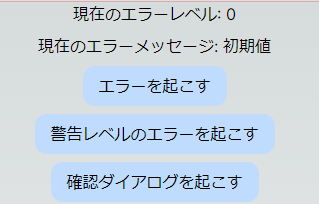
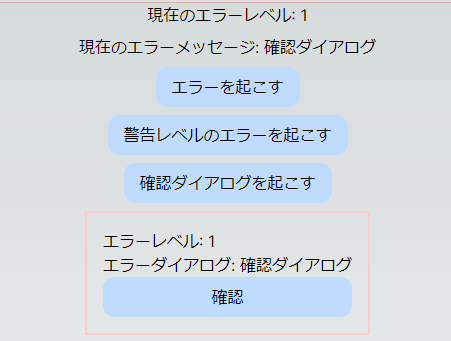
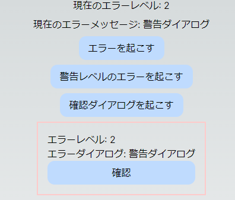

# エラーダイアログ表示サンプル
エラーログ管理のライブラリで良いのがあるかもだけど、なんだかんだ自分で書いた方が管理が楽なので書いたやつ。
(ライブラリの導入がほんと苦手で…)

# 方針
1. エラーメッセージは1つのファイルで管理する。コードの中に直接エラーメッセージを記述したくない。
2. エラーダイアログ表示メソッドを集約し、ログ収集の必要が出た時に仕込みやすくする。
3. DDDパターンとAtomic Designに基づくと、エラー状態管理のEntity層とダイアログコンポーネントのAtomsは共に上位なので、間をPresenter層で繋ぐ。

# ディレクトリ構成
DDDパターン, Atomic Designを元にディレクトリを構成。
```
.
├── src
│   ├── components
│   │   ├── atoms
│   │   │   └── modal.tsx
│   │   └── dialog
│   │       ├── index.tsx
│   │       ├── presenters.tsx
│   │       └── views.tsx
│   ├── constants
│   │   └── msgcode.ts
│   ├── domains
│   │   ├── entities
│   │   │   └── sys
│   │   │       └── msg.ts
│   │   └── usecases
│   │       └── manage-error.ts
│   └── pages
│       ├── _app.tsx
│       └── index.tsx
└── ...
```

DDDパターン、そしてPresentation層ではMVPパターンを採用しています。

`components`ディレクトリ内では、`atoms`と`molecules`のみAtomic Designを採用し、`organisms`より下位のコンポーネントはドメイン単位で区切る事にしています。

このあたりの設計に関しては、別途書きたいと思います。

# 定数宣言ファイルでエラーコードとメッセージを一括管理する。
エラーコードに対応するエラーメッセージと、そのエラーのレベルを設定します。
1つの変数に対して2つの値を返すので、辞書型で値を保持し、keyをエラーコードにして宣言します。

`/constants/msgcode.ts`
```
  export const enum MSG_CODE {
    API = 0x10000, // API関連
    API_ERROR = 0x10001,
    APP = 0x20000, // アプリ関連
    APP_WARNING = 0x20001, // 警告
    APP_INFO = 0x20002, // 確認
  }

  // メッセージレベル
  export const enum MSG_LEVEL {
    None = 0, // メッセージ解除
    Info = 1, // 情報表示メッセージ
    Warning = 2, // 警告メッセージ
    Error = 3, // エラーメッセージ
  }

  // メッセージのレベルとテキストを指定する型、この型でメッセージを通知する。
  export type MsgInfo = {
    level: MSG_LEVEL;
    message: string;
  };

  // これは公開しない
  const messageDict: Record<MSG_CODE, MsgInfo> = {
    [MSG_CODE.API]:         { level: MSG_LEVEL.None, message: 'APIエラー' },
    [MSG_CODE.API_ERROR]:   { level: MSG_LEVEL.Error, message: 'APIエラーダイアログ' },
    [MSG_CODE.APP]:         { level: MSG_LEVEL.None, message: 'APPエラー' },
    [MSG_CODE.APP_WARNING]: { level: MSG_LEVEL.Warning, message: '警告ダイアログ' },
    [MSG_CODE.APP_INFO]:    { level: MSG_LEVEL.Info, message: '確認ダイアログ' },
  };

  /**
   * エラーコードをエラーレベルとメッセージに変換する関数
   * @param code
   * @returns msgInfo
   */
  export const getMessageByCode = (code: MSG_CODE): MsgInfo => {
    const msgInfo = messageDict[code];
    return msgInfo;
  };
```

今回の例では、確認ダイアログ表示もここに含んでしまっています。
なのでエラーコードというよりメッセージコードなので、命名にちょっと問題アリですが、例えば
- 不具合が発生し動作を停止したいレベル
- 不具合が発生しているが、動作は止めないレベル
- 動作上問題はないが、何らかの不具合が起きる可能性を示すレベル

などで分類するとよいかもしれません。

React(Next.js)のようにSPAだとネットワーク接続がなくても動かせてしまうと思うので、ネットワークエラーの間はMSG_LEVEL.NetworkErrorレベルを保持しておいて、画面右端にダイアログを表示し続けるとか。

# RxJSライブラリを用いてエラー状態管理とイベント発行を行う。

「エラー状態管理」と銘打っているので、これはEntity層に入れてしまいます。

エラー状態になったらダイアログコンポーネントを表示するようにしたいですが、Next.js(React)はPresentation層のフレームワークとして扱うため、Domain層からPresentation層へ依存する事ができません。

そこで、RxJSを用いてイベントを発行し、React(Next.js)でイベントを購読するようにします。

`/domains/entities/sys/msg.ts`
```
/**
 * エラー状態管理ステートクラス
 */
export default class MsgState {
  private static _instance: MsgState;
  private _msgInfo: MsgInfo;
  public msgInfoAsObservable: BehaviorSubject<MsgInfo>;
  constructor() {
    this._msgInfo = getMessageByCode(MSG_CODE.DEFAULT);
    this.msgInfoAsObservable = new BehaviorSubject<MsgInfo>(this._msgInfo);
  }

  public static get instance() {
    if (!this._instance) {
      this._instance = new MsgState();
    }
    return this._instance;
  }

  public setMessage(code: MSG_CODE) {
    let msgInfo = getMessageByCode(code);
    if (msgInfo === undefined) {
      msgInfo = getMessageByCode(MSG_CODE.DEFAULT);
    }
    this._msgInfo = msgInfo;
    this.msgInfoAsObservable.next(msgInfo);
  }

  public clear() {
    const msgInfo = getMessageByCode(MSG_CODE.DEFAULT);
    this._msgInfo = msgInfo;
    this.msgInfoAsObservable.next(msgInfo);
  }
}
```

これをPresentation層であるダイアログコンポーネントのPresenterで購読します。

`/components/dialog/presenters.tsx`
```
/**
 * @package
 * @returns 
 */
export const MsgDialogPresenter = () => {
  const [msgInfo, setMsgInfo] = useState<MsgInfo>()
  useEffect(() => {
    const subscriber = msgInfoAsObservable.subscribe((_) => { setMsgInfo(_) });

    // コンポーネント破棄時にイベントリスナー破棄
    return () => subscriber.unsubscribe();
  }, []);

  return (<>
    {msgInfo && msgInfo?.level !== MSG_LEVEL.None && (
      <MsgDialogView msgInfo={msgInfo} okCallback={() => confirm()} />
    )}
  </>)
}
```

# デモ

では試しに動かしてみます。

`/pages/index.tsx`
```
export default function Home() {
  const [msgInfo, setMsgInfo] = useState<MsgInfo>()
  useEffect(() => {
    const subscriber = msgInfoAsObservable.subscribe((_) => { setMsgInfo(_) });

    // コンポーネント破棄時にイベントリスナー破棄
    return () => subscriber.unsubscribe();
  }, []);

  const buttonCss = "bg-blue-200 rounded-xl px-4 py-2"

  return (
    <main
      className={`flex min-h-screen flex-col items-center gap-2`}
    >
      <p>現在のエラーレベル: {msgInfo && msgInfo.level}</p>
      <p>現在のエラーメッセージ: {msgInfo && msgInfo.message}</p>
      <button className={buttonCss} onClick={() => setError()}>エラーを起こす</button>
      <button className={buttonCss} onClick={() => setWarning()}>警告レベルのエラーを起こす</button>
      <button className={buttonCss} onClick={() => setInfo()}>確認ダイアログを起こす</button>
      <MsgDialogPresenter />
    </main>
  )
}
```





# メモ
1. どのレイヤーでtry..catchでエラーハンドリングをすべきなのか？
  - 個人的にはusecase層だと思います。entities層（model層?）への依存は基本的にはusecase層からなので。

# あとがき
RxJSを使わなくてもReduxで同じ事ができるので、細かい事を考えないならReduxなのかなと思ってしまいます。
もしくはライブラリを探せば。
